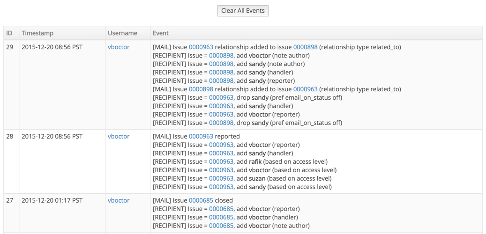

EventLog is a logging plugin for Mantis Bug Tracker.  This allows MantisBT components to log data that is then viewed via the EventLog plugin.

# Installation Instructions

- Place the EventLog folder under the MantisBT plugin folder.

- Go to Manage - Manage Plugins and install the plugin.

- Setup logging level in config_inc.php (see config_defaults_inc.php for documentation).  For example:

```php
$g_log_level = LOG_EMAIL | LOG_EMAIL_RECIPIENT
```

- Do some MantisBT activity (e.g. add notes, report bugs, etc).

- Go to the event log view by clicking: Manage - Event log

# Screenshot



# Compatibility

- Supports MantisBT v1.2.x -- use master-1.2.x branch
- Supports MantisBT v1.3.x -- use master branch
- Supports MantisBT v2.x.x (modern ui) -- use master-modernui

